# Lupac Industrial Equipment

Catálogo digital de maquinaria industrial optimizado para SEO y rendimiento.

## Detalles del proyecto

- **Nombre:** Lupac Industrial Equipment
- **Descripción:** Catálogo digital de maquinaria industrial optimizado para SEO y rendimiento.
- **Stack:** React, Vite, Tailwind CSS

## Página en línea

[https://lu-pac.com/](https://lu-pac.com/)

## Banner principal

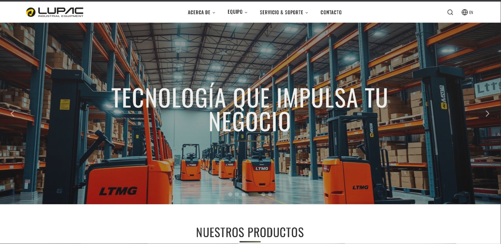

## Capturas de escritorio

<table>
  <tr>
    <td>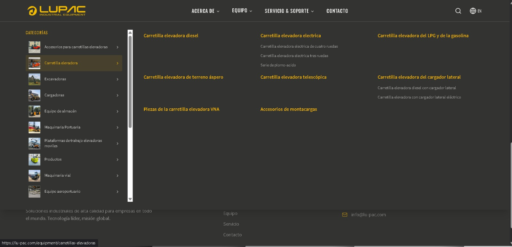</td>
    <td>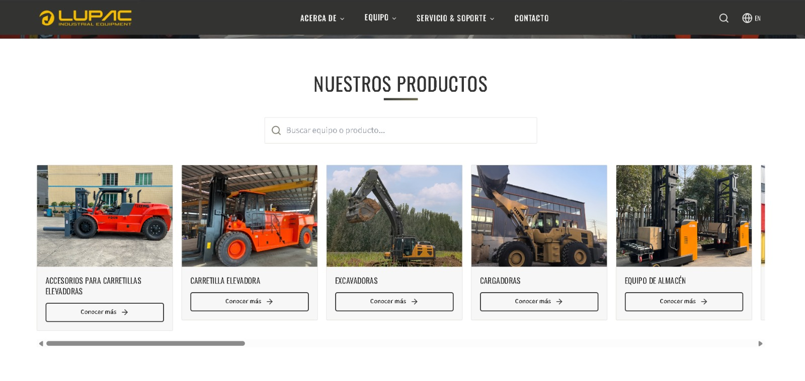</td>
  </tr>
  <tr>
    <td>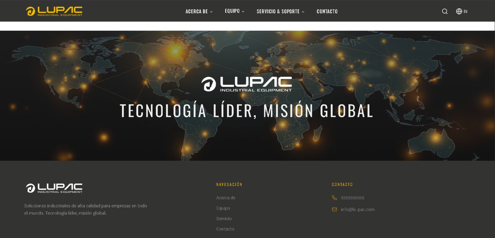</td>
    <td>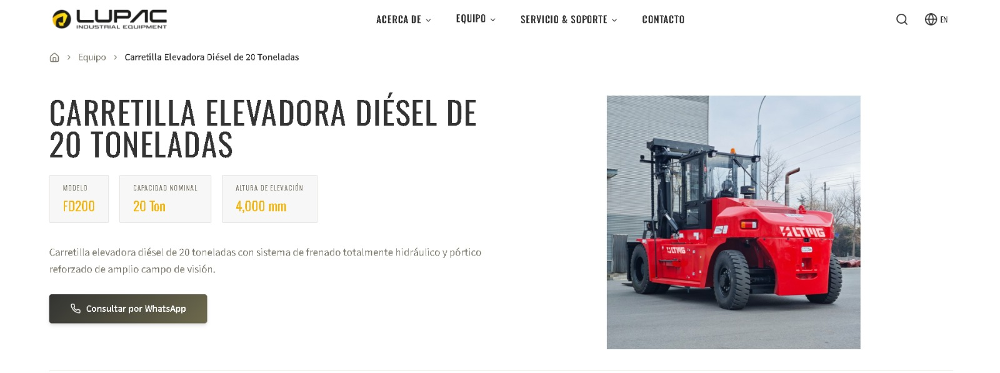</td>
  </tr>
  <tr>
    <td>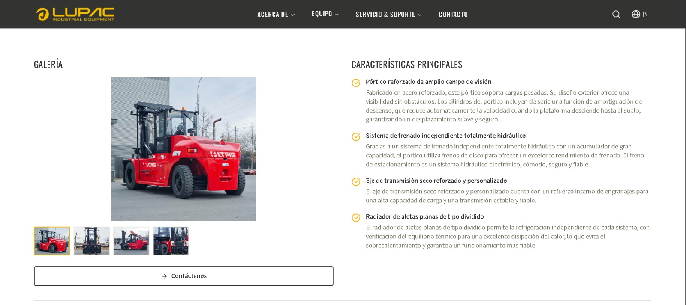</td>
    <td>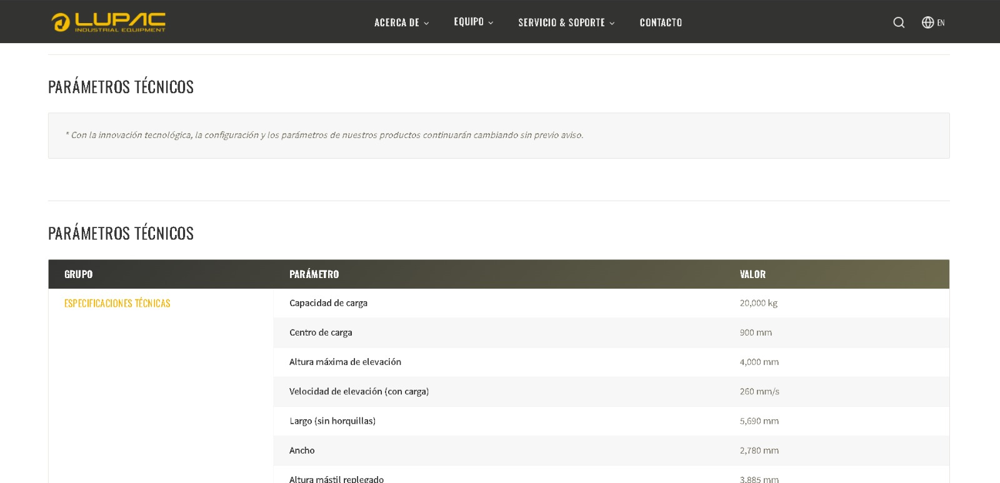</td>
  </tr>
  <tr>
    <td>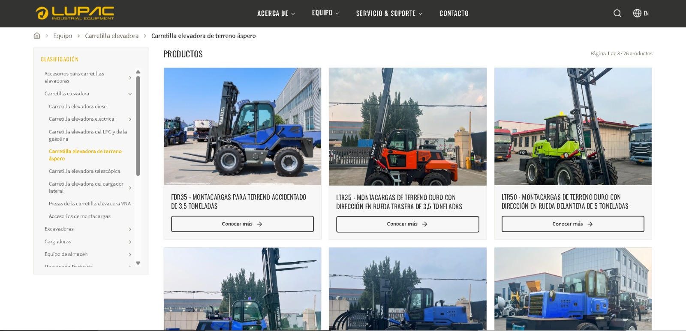</td>
    <td>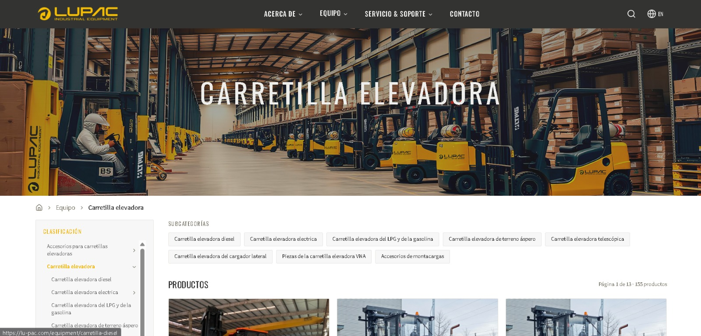</td>
  </tr>
</table>

## Responsive Design

<table>
  <tr>
    <td>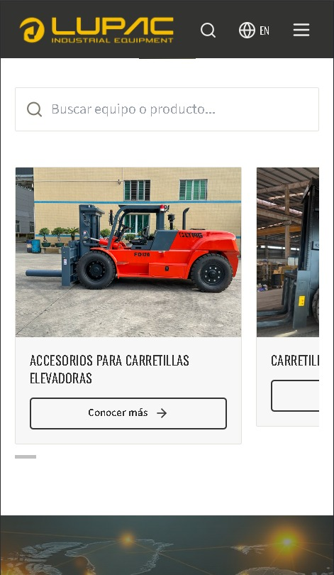</td>
    <td>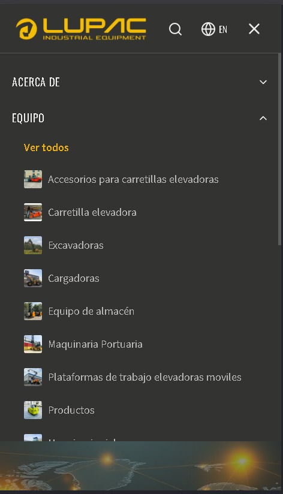</td>
  </tr>
</table>

> Nota: El código y los contenidos del proyecto son propiedad intelectual de la empresa.
